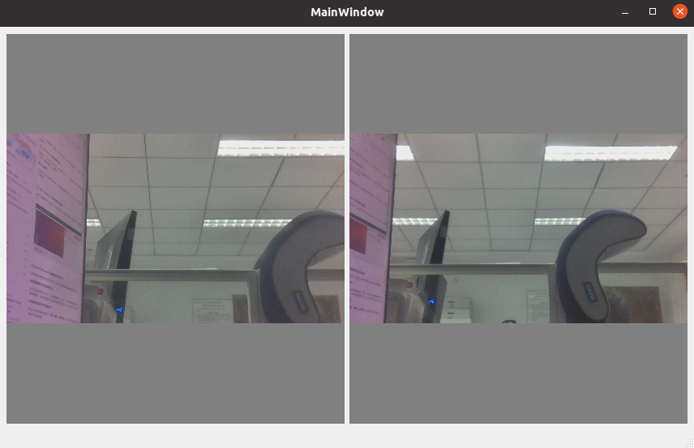

# mipi_depth_camera

硬件部分与博客 [多目深度相机(二) mipi多目相机取流](https://developer.horizon.cc/forumDetail/177840463137677406) 保持一致

首先将项目挂载到板端
```shell
# ssh登陆板端
ssh root@192.168.3.70
# ip地址和文件夹路径根据实际修改
mount -t nfs -o nolock 192.168.3.26:/home/lza /app/code_liu
```
## mipi_camera_board
该程序为板端运行双目取流,会取两个imx219的图像数据,将图像数据编码为jpg,并通过tros将图像数据转发
### 程序编译与运行

本程序参考的是地平线官方例程/app/multimedia_samples/get_sif_data。

具体程序为mipi_camera_board文件夹下的源码程序
#### 程序编译

注：首先需要按照[多目深度相机(一) RDK Module tros消息通信编译示例 (horizon.cc)](https://developer.horizon.cc/forumDetail/174216054053200985)搭建好交叉编译平台

- 修改mipi_camera_board/src/mipi_camera_board/CMakeLists.txt中的sys_docker文件路径

```CMake
# 设置包根目录 需要根据实际情况修改
set(HOST_PACKAGE_DIR /home/lza/cc_ws/sysroot_docker/)
```

- 在电脑端运行：

```shell
cd mipi_camera_board
bash build.sh
```
#### 程序运行
在板端运行：

```shell
bash start.sh
```

即可看到打印log如下所示：

``` shell
msg send completed!
try to get img...
normal pipe_id (1)type(11)frame_id(0)buf_index(2)w x h(1920x1080) data_type 11 img_format 0
mat success
get img cost time 2 ms
```
## mipi_camera_x86
该程序为x86电脑端运行可视化界面,能够接收由板端发布的两个摄像头的数据,可视化界面基于pyqt5编写

### 程序编译
- 在电脑端运行：
```shell
cd mipi_camera_x86
bash build.sh
```
### 程序运行
在板端成功运行mipi_camera_board的基础上,运行mipi_camera_x86
```
bash start.sh
```
会唤起可视化界面,如下图所示的双目图像

**注意,目前电脑端可视化还有些问题,当推流一段时间之后,电脑端无法接收到新图片,板端仍然正常**



# TODO
- [ ] SGBM深度生成,并完成可视化界面
- [ ] 集成yolo5,完成目标检测的同时检测深度
- [ ] 集成tof摄像头